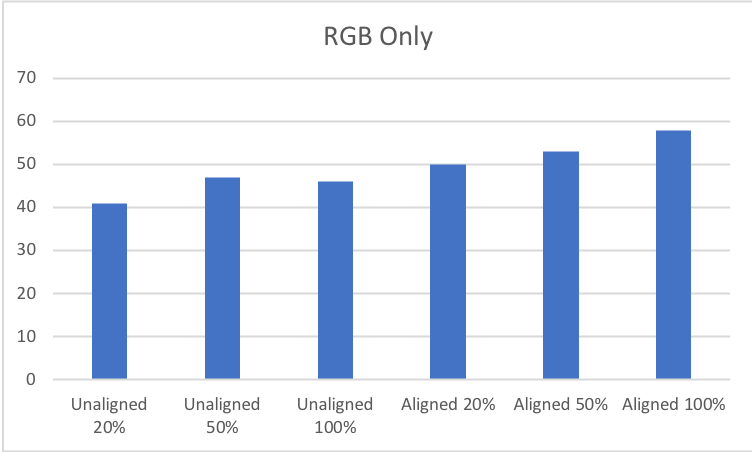
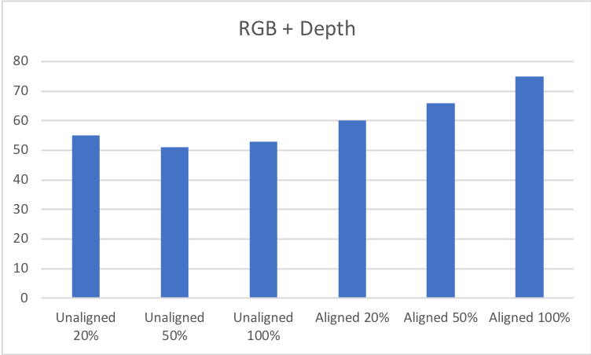
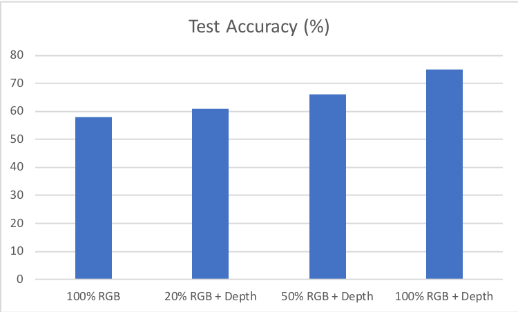
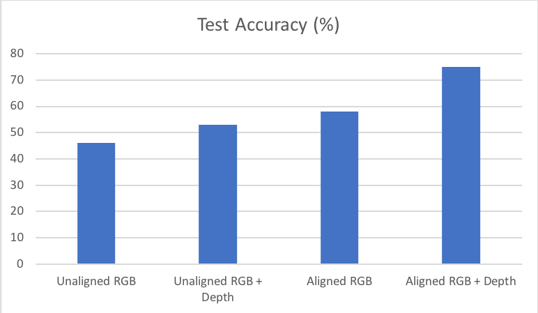

# Whether Unsupervised Learning Depth and Optical Flow can Help Few Shot Supervised Learning

## Requirement
- PyTorch 0.3.1
- Python 2.x

## Motivation
Although deep neural networks have achieved promising results on visual recognition, human uses far fewer supervised training labels to reach to the same level. In thie work, we study how much depth, optical flow and top-down keywords can help object recognition and localization in cluttered scenes, particularly when there are not enough training labels.
- There is an intuition that depth can significantly help attention and recognition for objects in clutted scenes. There is also another intuition that optical flow can help to attention to the correct region pointed by keywords.
- For the depth and optical flow data, we simply use ground truth already existed in the datasets. In the next future, we will also study the unperfect unsupervisedly trained depth and optical flow estimation from [Other works](https://arxiv.org/abs/1711.05890).

## Problem Setting
Our ultimate goal is to study how much depth and optical flow can help high level semantic level tasks such as object recognition and localization, particularly when there are not enough training data. Hence our problem setting is below:
1. Given a direction keyword and a cluttered RGB image (with depth & optical flow), how is the recognition accuracy?
2. Given an object keyword and a cluttered RGB image (with depth & optical flow), how is the localization accuracy?
3. Given a few supervised training labels, how does the unsupervised (depth & optical flow) help recognition / localization accuracy?

## Benchmark & Criteria
We use the average recognition accuracy and localization accuracy as the quantitative measure:
1. The recognition accuracy is very simple, it is the same as the imagenet top-1 accuracy.
2. The localization accuracy is the average proportion of correctly predicted bounding box, where a bounding box is considered as correct if its IoU with the ground truth box is over 50%. 
3. We will further replace the localization problem to another word prediction problem (i.e. left, right, top, down, etc.), then we will merge the two tasks into one task which is word prediction (i.e. car, pedestrian or left, right). We will then use the word prediction accuracy as the final measure.

## Dataset
We mainly use four datasets for experiments.
1. [Mnist dataset](http://yann.lecun.com/exdb/mnist/): This is simply for debug model and code.
2. [MLT dataset](http://robots.princeton.edu/projects/2016/PBRS/): This is the main dataset we use to study depth effect because they contain ground truth object semantic segmentation, instance segmentation, depth, etc. MLT dataset contains 45K synthetic 3D indoor scenes with 400K fully annotated rendered images from different viewpoints.
3. [VIPER dataset](http://playing-for-benchmarks.org/): This is the other main dataset we use to study optical flow effect because they contain ground truth object semantic segmentation, instance segmentation, optical flow, etc. VIPER dataset contains 250K fully annotated high resolution video frames.
4. [KITTI dataset](http://www.cvlibs.net/datasets/kitti/): This is the final dataset we are planning to use. But so far for simplisity, we haven't used it yet.

## Model
We find it is straightforward to use the attention models to conduct the experiments. There are two variations of attention models: 
(1) Hard attention models such as [Spatial Transformer Networks](http://torch.ch/blog/2015/09/07/spatial_transformers.html) and [Recurrent Model of Visual Attention](http://torch.ch/blog/2015/09/21/rmva.html).
(2) Soft attention models such as [Show, Attend and Tell](http://kelvinxu.github.io/projects/capgen.html). In this work, we also study the effect of these two different attention models on the recognition and localization tasks.

## Preliminary Results

# 5/3/2018
- Summarize the performance of using the bounding box to align v.s. no aligned and using RGB + depth v.s. RGB only, on [MLT dataset](http://robots.princeton.edu/projects/2016/PBRS/) with 7000 training images and 700 testing images for 6 most frequent classes. 
- Try to train a residual network to beat the previous VGG network, but residual network obtains worse performance on all different tasks. Need to figure out why.
{:height="70px" width="40px"}
{:height="70px" width="40px"}
{:height="70px" width="40px"}
{:height="70px" width="40px"}

- Start to involve attention models to recognize objects. Previously we manually crop the image patch based on the bounding box. Now we use spatial transformer networks to crop the image based on the bounding box.
- To make training/testing more stable, now use 10742 training images and 4605 testing images, 6 classes on [MLT dataset](http://robots.princeton.edu/projects/2016/PBRS/).
- Performance summarization: Random guess is 25%, brute-forcely train with only image 40%, brute-forcely train image with box 62%, suggesting a high location prior in the image, spatial transformer attention crop with gt box 69%.

- The attention model (spatial transformer networks) does not work on MLT dataset so far. 
- I find the model struggling in finding the correct object location, and is very sensitive to initialization.
- Debug attention networks on Mnist dataset-
 and find it even fails on simple Mnist data. Below is an illustration

- The attention model (spatial transformer networks) can work now on Mnist dataset, when Mnist digits are randomly uniformly located in the image. Both image-based attention and word-based attention can provide reasonable attention. Jointly train them can achieve even better and faster convergence on learning classifiers and attention models.

- Conduct comparison between hard attention model and soft attention model on Mnist dataset. Conclusion: using soft attention model performs much more smoother and faster convergence compared to previous hard attention (spatial transformer networks). The oracle performance of soft attention model may be slightly worse than the best hard attention model on recognition, however, in reality training converges much smoother.
- Here I show the training convergence using the soft attention model and a baseline hard attention model (orange) on Mnist dataset. One can see the three (red, cyan, gray) soft-attention curves all converge much faster than the (orange) hard-attention (spatial transformer networks) curve. For more hard attention model performances, please see the last week (5/24/2018) note.

- On Mnist two object dataset, using the ground truth direction lead to the best convergence which now makes a lot of sense.

- Working on soft-attention model and switch back to MLT dataset because Mnist dataset is too simple.
- On MLT dataset, there are two main promising conclusions: 
1. Adding depth significantly helps image recognition. For example, the testing recognition accuracy increases from 42% to 48% by adding depth. And after adding top-down direction signal, the testing accuracy further increases from 48% to 72% which is about 30% total absolute improvement to the baseline RGB only.
2. Adding top-down direction as keyword to obtain attention significantly helps image recognition. For example, the testing recognition accuracy increases from 48% to 61% by adding top-down direction on RGB image.
- In total, the depth and direction keyword can significantly improve recognition accuracy from 42% to 72%, increasing 30%, and the training actually has not converged yet. And all curves haven't converged yet.

- An illustration of the soft attention model

